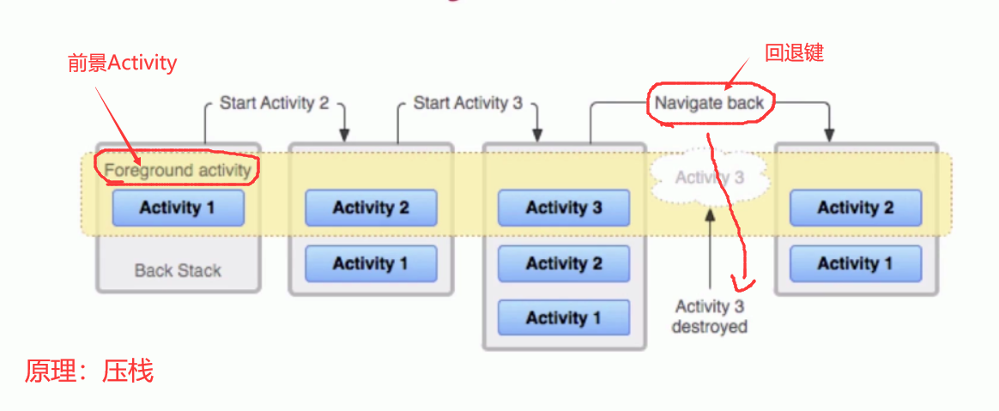
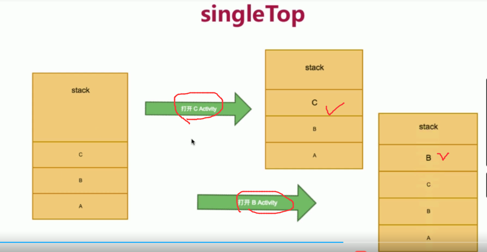
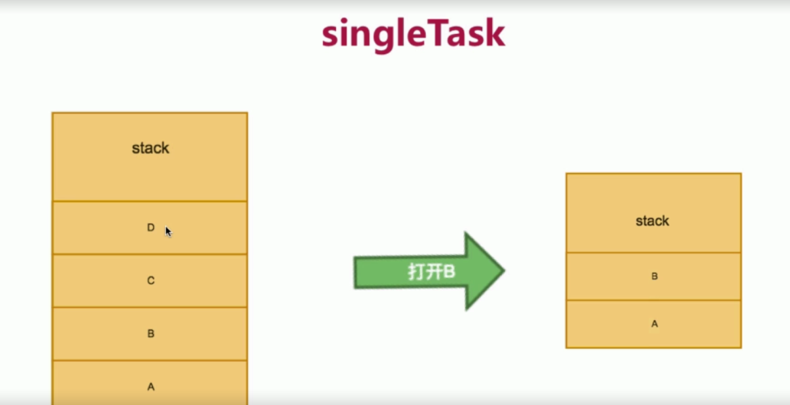
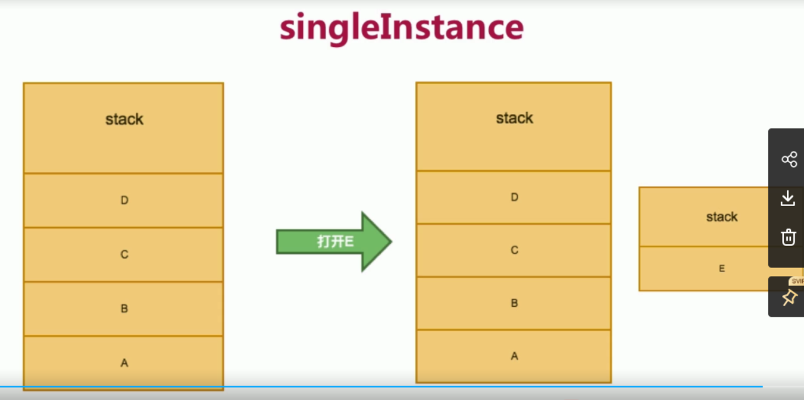
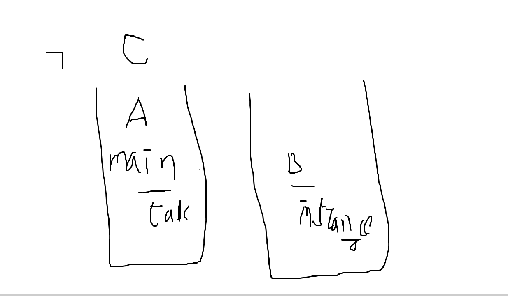

### Activity

Activity

#### 创建一个Activity的步骤

1. 定义一个class类（**TestActivity**.java）
2. 继承（**AppCompatActivity**）
3. 去manifest配置文件当中注册。（<Activity android:name = ".TestActivity">）否则会闪退。 

#### Activity方法

##### 1.与Layout绑定

- **setContentView(R.layout.activity_main);**

##### 2.取控件

- **findViewByID(ID)**
- **DataBinding**。setContent负责显示。databinding负责绑定。

##### 跳转Activity

1. **Intent intent = new Intenrt(MainActivity.this,TestActivity.class);**
2. **startActivity(intent);**

#### Activity跳转原理

- 栈。（不一定只有一个Activity栈）。
- 对于当前显示Activity，一定是再栈顶的。
- **主栈：launcherActivity的所属栈。**

#### Activity四种启动模式

##### 设置和默认

再manifest.xml文件当中，activity标签下设置LauncherMode属性。

默认的Activity启动模式为standrad标准模式。

##### standrad 标准模式

- 会把当前的activity加入到**启动它**的那个activity的**栈**上。
- 重新加载onCreat()一个**新的**activity。
- 如下的Activity2和Activity3是standrad启动模式。

##### singleTop 顶部复用模式

- 保持**顶部**Activity的唯一性。复用顶部Activity。
- <**也就是自己启动自己是无效的。不会创建一个新的Activity** >
- 如下所示，ActivityC的启动模式是singleTop。

##### SingleTask 单任务模式

当一个Activity的启动模式是SingleTask的时候。如下图

- 打开ActivityB，将DC弹出栈。如果启动ActivityE的时候，发现栈中没有E，压在栈顶。

##### SingleInstance 单例模式

加强版的singleTask。单独出一个栈存放模式为singleInstance的Activity。

坑一：

main----> A----> B（singleInstance） ----> C。

back键：【】为栈

【C-->A-->Main】 -->【B】 --->主界面

坑二：

Home键。返回。再次点击图标进入。

会回到主栈。有Activity的话，显示顶层的activity，没有的话，显示Launcher。

但是SingleInstance好像没了？泄露了？

top：不能自己创建自己。

task：不能自己创建自己。创建下面有的出栈。

instance：不能自己创建自己。创建下面有的出栈。单独栈。

#### Activity生命周期 OK

onCreated():的意思是当调用了onCreated()方法之后，才会进入create状态。

#### Activity之间数据传递 OK

A---->B

- 直接putExtra。
- 参数设置为Bundle。
- 参数为序列化的一个对象。可以传递对象了。实现了seriable接口。

B----->A 反传。

