### View 控件的根。布局也是控件？

android当中所有可视的空间都叫做View。

- **TextView**
- **Button**
- **EditView**
- **ImageView**
- **ProgressBar**
- 布局也是view。继承。

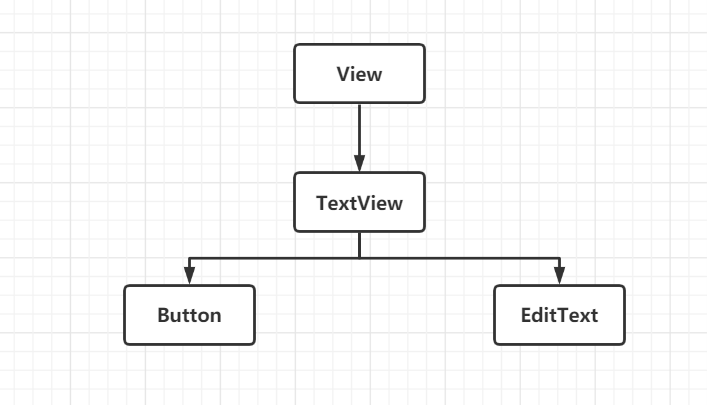

### 通用属性：代表view？

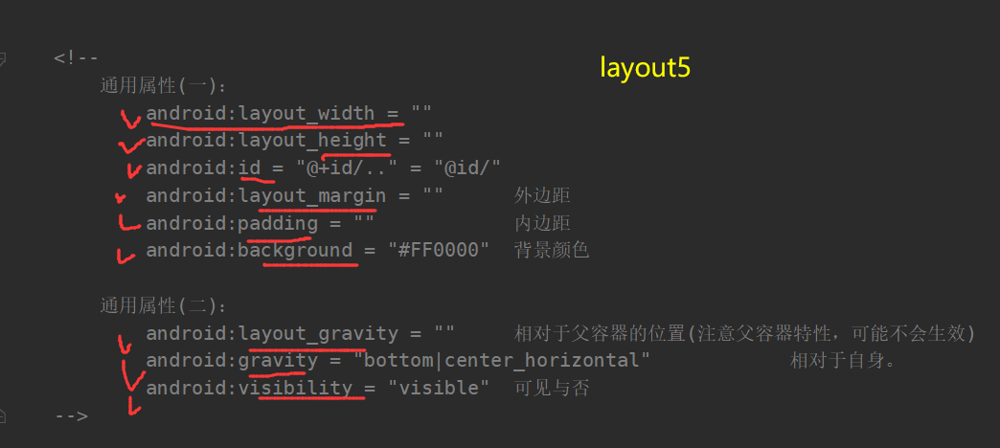

### TextView

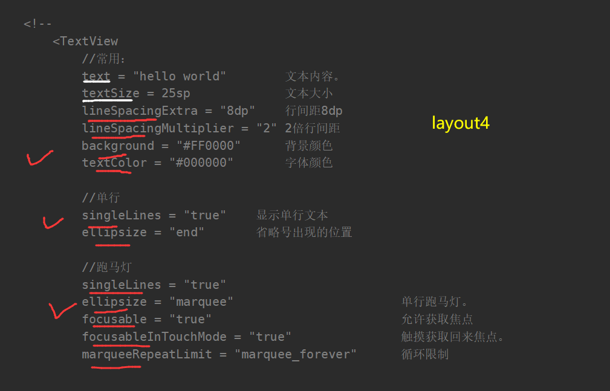

### EditText

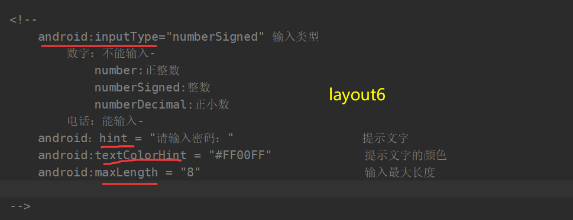

### Button

四种点击事件

#### 内部类

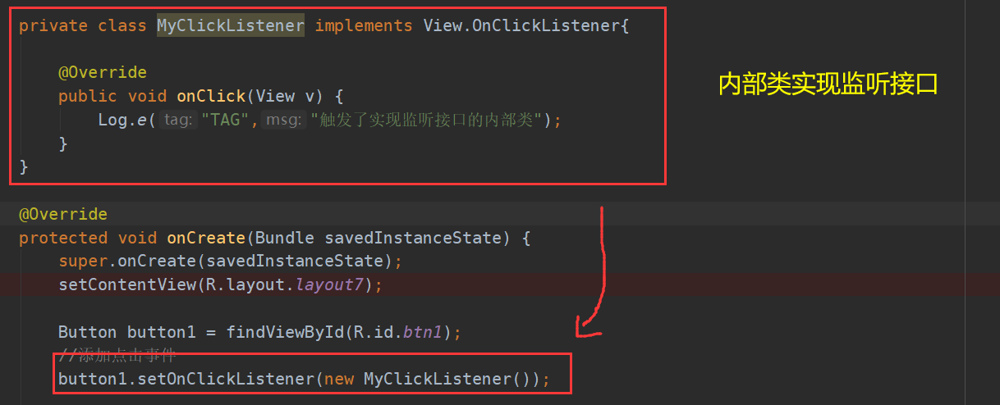

#### 匿名内部类

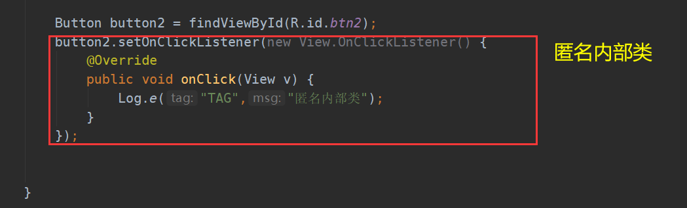

#### Activity

实现接口。

传入this。

#### XML 

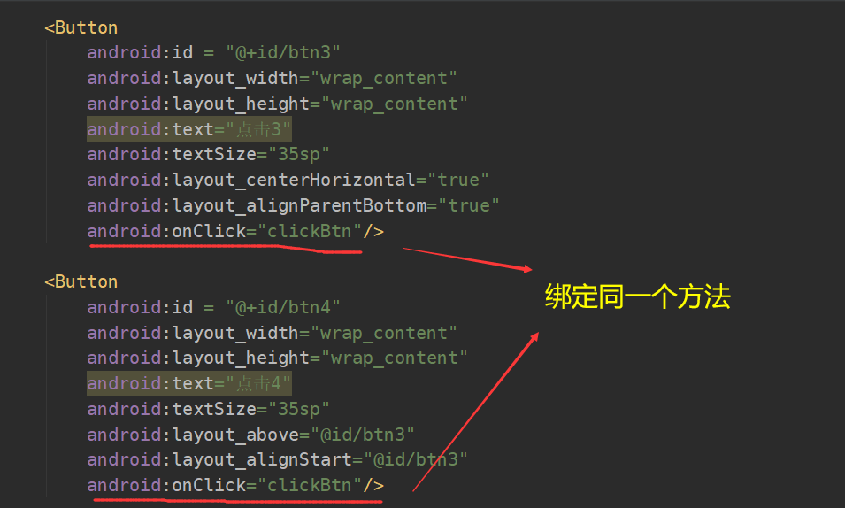

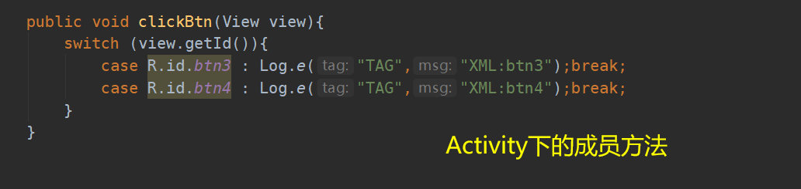

### ImageView

android:src = 

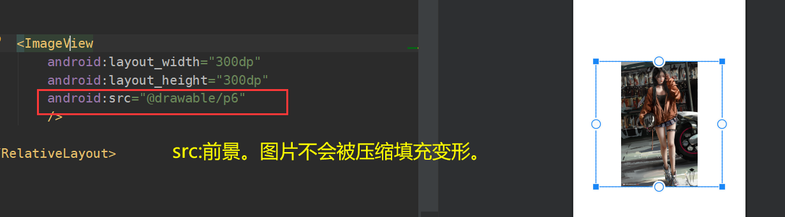

android:background = 

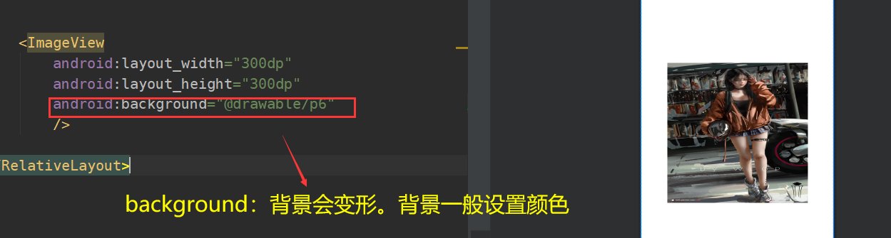

### ProgressBar

进度条

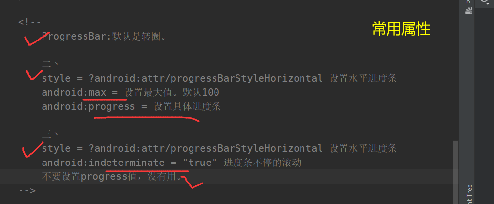

代码控制进度条

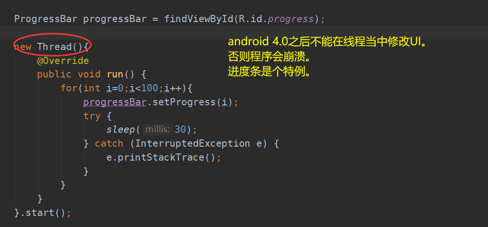

### Seekbar

#### XML

- **android:max = "100"**
- **android:progress = "35" //seekbar的默认位置。**

#### Code

普通方法

- **setProgress(35);//设置progress**
- **getProgress();//获得progress**
- **setMax(120)//设置max**

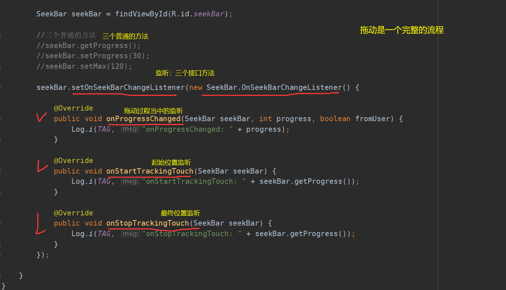

**LogCat打印：**

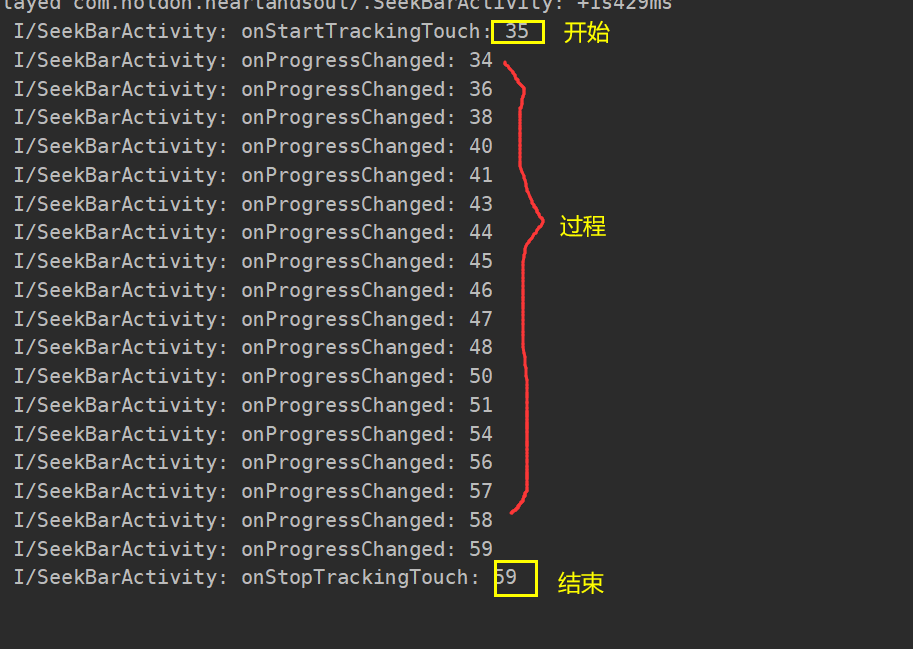

#### SeekBar和progressBar

- **SeekBar可以拖拽。progressBar只能显示。**

### CheckBox（多选）

#### **XML**

- **android:checked = "false/true" 设置选中状态。**
- **用LinearLayout包裹若干个checkBox控件。**

#### Code

- **setChecked(true/false) //设置选中状态**
- **boolean isChecked()//返回选中状态**

**监听**

只能对**每一个checkBox**经行监听。

- checkbox.**setOnCheckedChangeListener**（new **CompoundButton.OnCheckedChangeListener(){}**）；.

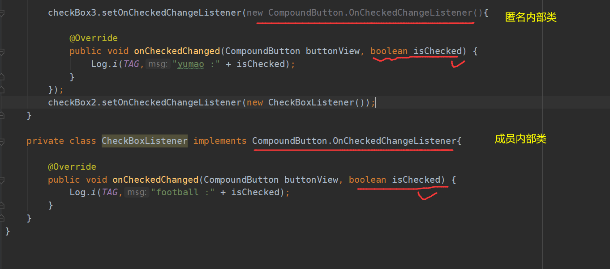

### RadioButton（单选）

**需要用RadioGroup包裹，去实现单选。**

**XML**

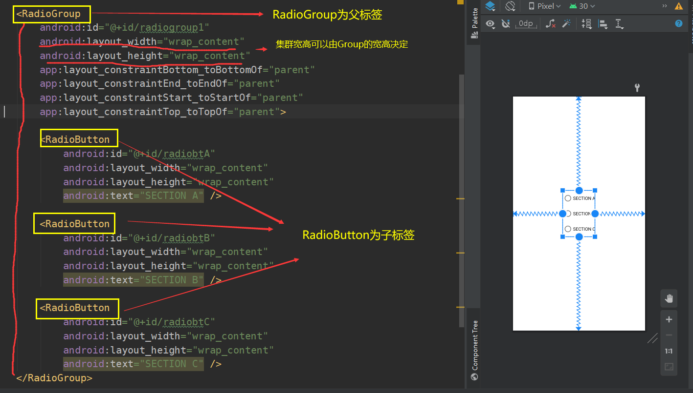

**Code**

**监听1：监听RadioGroup：****RadioGroup.OnCheckChangeListener**

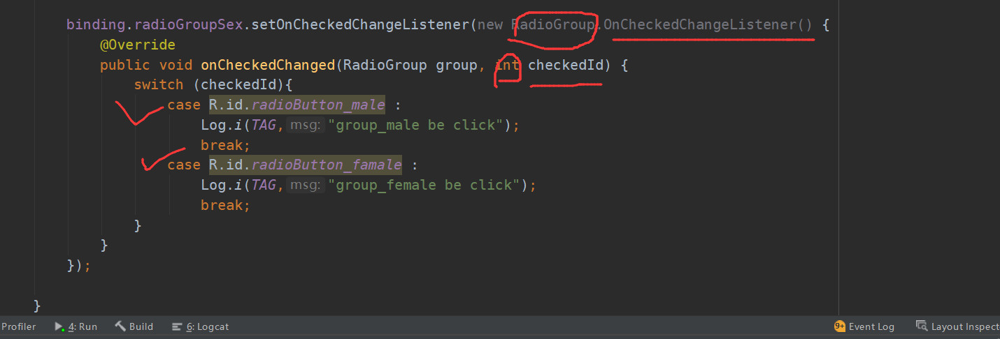

**监听2：监听RadioButton：**

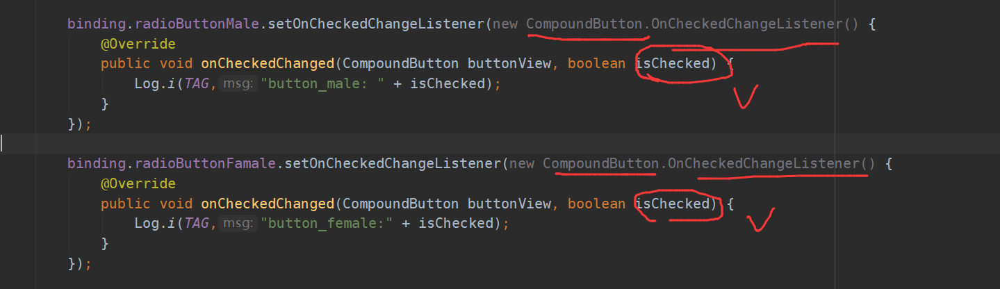

### 区别（check和radio）

1. checkBox可以点击切换状态。radioButton不行。
2. checkBox可以当多选。radioButton不行。
3. radio是圆的。checkbox是方的。
4. **单个按钮的监听是一样的**
   1. **checkbox.setOnChekedChangeListener(new CompoundButton.OnCheckedChangeListener(){});**
   2. **radiobutton.setOnChekedChangeListener(new CompoundButton.OnCheckedChangeListener(){});**

### ToggleButton

和**switch**开关差不多。有两种状态。

**上面的文字实现当前按钮的状态。显示textOn或者textOff。**

##### **XML**

- **android:textOn=""**
- **android:textOff=""**
- **android:checked="true/false"**
  - **true显示textOn，false显示textOff。**

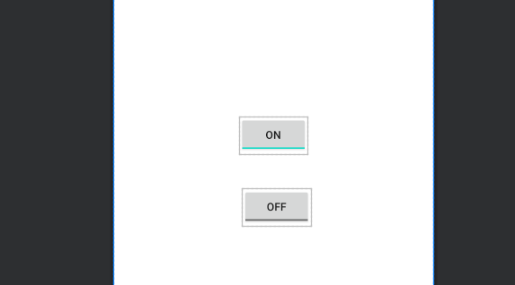

##### Code

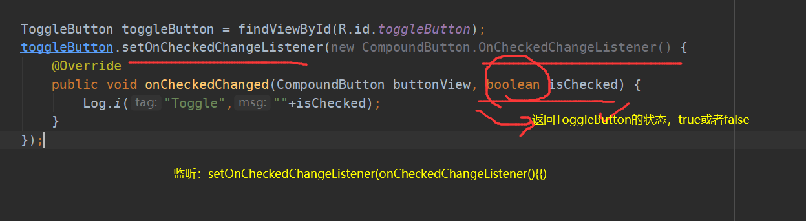

还有一个方法

- **setChecked(true/false)；**

### 