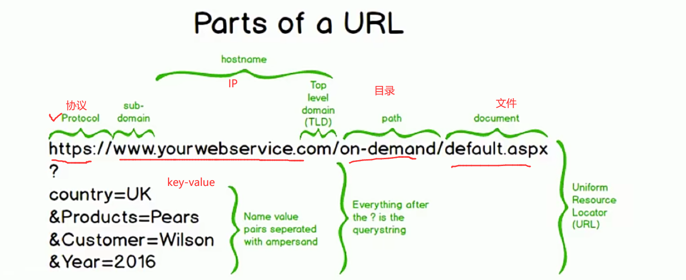
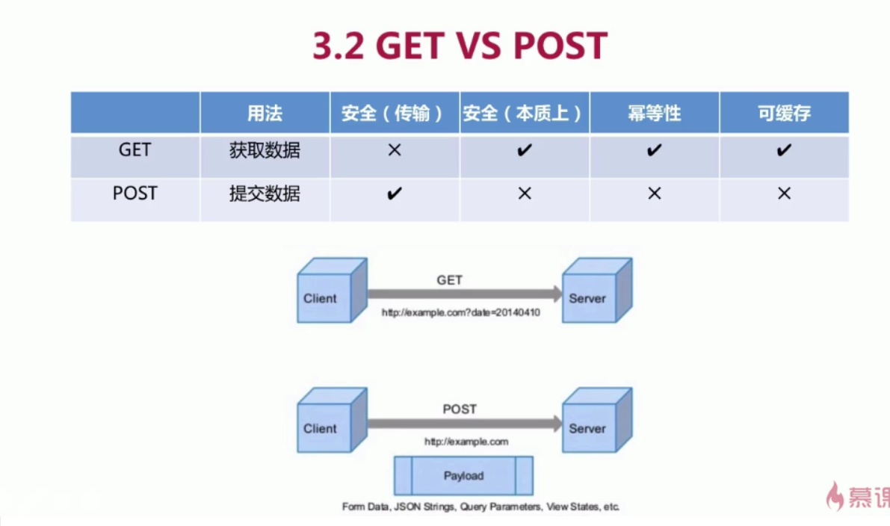

#### 协议架构

- Application(应用层)：FTP [**HTTP**] SMTP DNS TFTP
  - 应用层：传输来的数据怎么去解释。
- Transport(传输层)：**TCP**，**UDP**
  - 传输层：表示数据怎么样去传输。
- Internet(网络层)：IP
- NetWork Access (连接层)：LAN，WAN

#### TCP

传输层协议。

三次握手，四次挥手。

#### HTTP

**HTTP是基于TCP/IP的应用层协议。**

#### HTTP和TCP区别

- http是应用层协议，tcp是传输层协议。
- http注重的是如何**解析**数据。tcp注重的是数据如何**传输**。
- **HTTP是基于TCP的。**

#### URL

组成

- **协议 :// 域名[: 端口]/ 虚拟目录 ?参数(key-value)**

#### GET/POST

GET和POST是HTTP的请求方式。

GET和POST都是

